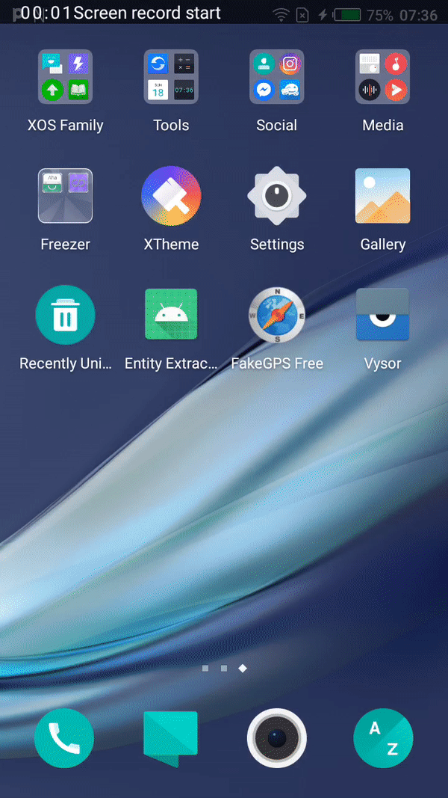

# EntityExtractionMLKit
This project  is about how we can extract entities from the text using Google's ML kit on Android. 

Google's on-device ML Kit introduced another useful API for Entity Extraction, which extracts the entities from the static text or while typing based on that once an entity is extracted you can easily enable different actions for the user based on the entity type. 
The Entity Extraction API supports multiple languages like English, Arabic, French, German rest of the list you can check from here.

# What is ML Kit?
ML Kit is a cross-platform mobile SDK (Android and iOS) developed by Google that allows developers to easily access on-device mobile machine learning models.
All the ML Kit's APIs run on-device, allowing real-time and offline capabilities.
To use the standalone ML Kit on-device SDK, we can just implement it directly - we don't need to create a project on Firebase or an accompanying google.json file.

# Demo

